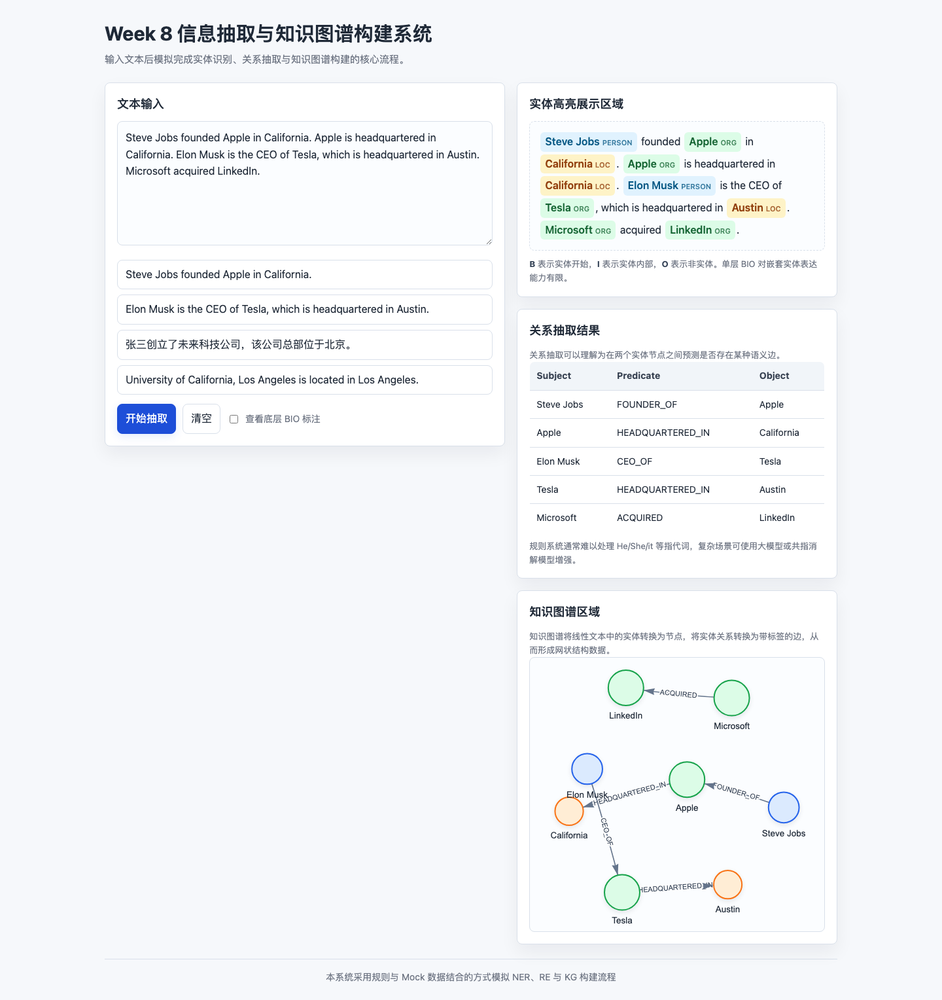

# EntityGraph Studio

## 页面概览



EntityGraph Studio 是一个轻量级信息抽取与知识图谱工作台，面向需要快速把非结构化文本转换为结构化实体、关系和网络图谱的场景。项目提供可交互的 Web 界面和可复用的 Python 核心模块，适合用于原型验证、内部工具演示、规则抽取基线和知识图谱流程说明。

## 核心能力

- 命名实体识别：支持 Person、Organization、Location 三类实体，并对重叠实体采用最长匹配优先策略。
- BIO 标注检查：一键切换实体高亮视图和底层 BIO 序列，便于定位实体边界。
- 关系抽取：识别 `FOUNDER_OF`、`CEO_OF`、`HEADQUARTERED_IN`、`LOCATED_IN`、`ACQUIRED` 等语义关系。
- 知识图谱可视化：基于 `vis-network` 渲染可拖拽、可缩放的交互式实体关系网络。
- 双语样例支持：内置英文和中文业务文本样例，便于快速验证抽取链路。

## 快速开始

直接打开 `index.html` 即可运行，也可以启动一个本地静态服务器：

```bash
python3 -m http.server 8080
```

然后访问：

```text
http://localhost:8080
```

## Python 核心模块

`ie_core.py` 暴露了完整的信息抽取入口：

```python
from ie_core import extract_information

result = extract_information(
    "Steve Jobs founded Apple in California. Microsoft acquired LinkedIn."
)

print(result["entities"])
print(result["relations"])
print(result["graph"])
```

返回结果包含：

- `entities`：实体文本、类型和字符 offset。
- `bio`：token 级 BIO 标注序列。
- `relations`：主体、谓词、客体三元组。
- `graph`：可直接传给前端图谱组件的节点与边数据。

## 项目结构

```text
.
├── assets/
│   └── overview.png
├── src/
│   ├── app.js
│   └── styles.css
├── vendor/
│   └── vis-network.min.js
├── index.html
├── ie_core.py
├── LICENSE
└── README.md
```

## 技术栈

- HTML / CSS / JavaScript
- vis-network, vendored locally for stable static hosting
- Python 3 标准库

## 适用边界

当前实现采用透明的规则、词典和触发词策略，优点是可解释、轻量、无需模型依赖；如果需要处理更复杂的指代消解、跨句关系、开放域实体类型或大规模语料，可以在 `ie_core.py` 的抽取层接入 spaCy、Transformers 或大模型 API。
